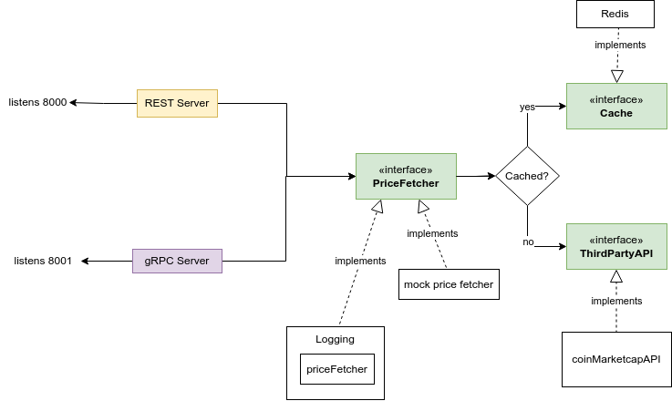

# Crypto Currency Price Fetcher

training project for practicing gRPC , REST and some patterns




**Tools used In this mini project:**

* Golang
* Redis 
* gRPC
* viper (for binding env)

**Design Principles and Patterns used :**
* IoC
* Decorater
* Factory


## Usage

Runing servers :
```bash
go run main.go
```


## Roadmap

- Add Pushing to Prometheus 

- Add Test

- Add more info to Responses

